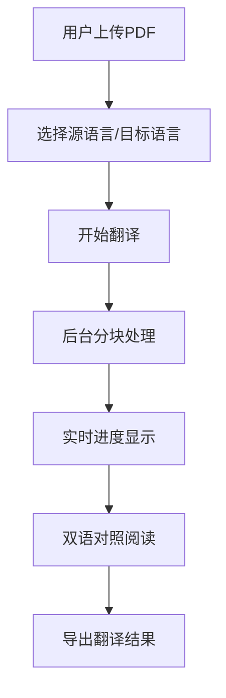

## 1. 产品概述
LingoDoc是一个PDF翻译网站，支持大文件（最高3000页）翻译，保持原排版，提供双语对照阅读体验。
- 解决学术论文、技术文档、长篇书籍等大体积PDF的翻译需求
- 核心优势：大文件支持、保持原排版、双语对照阅读

## 2. 核心功能

### 2.1 用户角色
| 角色 | 注册方式 | 核心权限 |
|------|----------|----------|
| 普通用户 | 无需注册 | 上传PDF、翻译、对照阅读、导出结果 |

### 2.2 功能模块
1. **首页**：文件上传区、功能介绍
2. **翻译页面**：语言选择、进度显示、双语对照阅读
3. **结果页面**：预览、下载

### 2.3 页面详情
| 页面名称 | 模块名称 | 功能描述 |
|----------|----------|----------|
| 首页 | 文件上传区 | 拖拽或点击上传PDF，支持大文件，显示文件信息 |
| 首页 | 功能介绍 | 展示核心功能：大文件支持、保持排版、双语对照 |
| 翻译页面 | 语言选择 | 选择源语言和目标语言 |
| 翻译页面 | 进度显示 | 实时显示翻译进度、已处理页数 |
| 翻译页面 | 双语对照阅读 | 左右分栏显示原文和译文，同步滚动 |
| 结果页面 | 预览区 | 预览翻译结果 |
| 结果页面 | 导出功能 | 支持导出双语PDF、纯译文PDF、文本文件 |

### 2.4 扩展功能（第二阶段）
| 功能名称 | 描述 |
|----------|------|
| 词语高亮对应 | 选中译文词语时，原文对应位置高亮显示 |
| 多翻译服务选择 | 用户可选择不同翻译服务 |

## 3. 核心流程
用户上传PDF → 选择语言 → 开始翻译 → 实时进度 → 双语对照阅读 → 导出结果

## 4. 用户界面设计
### 4.1 设计风格
- **主色调**：深蓝色（#1E40AF）+ 青色（#06B6D4），专业科技感
- **辅色**：浅灰背景，白色卡片
- **按钮风格**：圆角矩形，渐变背景，悬停放大效果
- **字体**：标题用 Poppins，正文用 Inter
- **布局风格**：卡片式布局，清晰层次结构

### 4.2 页面设计概述
| 页面名称 | 模块名称 | UI元素 |
|----------|----------|--------|
| 首页 | Hero区域 | 渐变背景，大标题，上传拖拽区 |
| 首页 | 功能特性 | 三列卡片布局，图标+文字说明 |
| 翻译页面 | 控制栏 | 固定顶部，进度条，语言选择 |
| 翻译页面 | 对照阅读区 | 左右50:50分栏，同步滚动 |
| 结果页面 | 预览区 | 居中显示，下载按钮组 |

### 4.3 响应式
桌面优先设计，移动端自适应布局。
